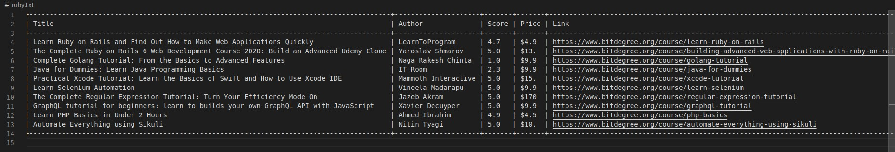

# BitDegree search-page scraper
 

## What is Web scraping?

Web scraping, also known as web data extraction, is the process of retrieving or “scraping” data from a website. Unlike the mundane, mind-numbing process of manually extracting data, web scraping uses intelligent automation to retrieve hundreds, millions, or even billions of data points from the internet’s seemingly endless frontier.

[scrapinghub](https://www.scrapinghub.com/what-is-web-scraping/)

## What does this Web scraper do?

This a Web scraper specially built for collecting data from BitDegree's search page. The user will input the link from which he wants to scrap the information from and the program returns a file with the results.

## Built with:

- Ruby

**Features**
- [RSpec](https://rspec.info/)
- [Nokogiri](https://nokogiri.org/)
- [Terminal-table](https://github.com/tj/terminal-table)
- [Rubocop](https://github.com/rubocop-hq/rubocop)

## How to use this scraper?

- [Using live demo](#Using-live-demo)
- [On your machine](#On-your-machine)

## On your machine

**Pre-requisites**

- Having [Ruby](https://www.ruby-lang.org/en/) installed on your machine.

- If you want to run the tests you should have [RSpec](https://rspec.info/) installed on your machine.

### Setting up instructions

**In case you use Git**

1. Open terminal 

2. Run the following commands:

- git clone https://github.com/AlduLonghi/Web-scraper.git

- cd Web-scraper

- bin/main.rb

3. Follow the instructions.

**In case you don't use a control version system**

1. Go to [the repository](https://github.com/AlduLonghi/Web-scraper.git)

2. Press the green button that says "Code".

3. Press "Download zip".

4. Once downloaded, extract the files.

5. Right click on the folder, press "Open in terminal".

6. Run bin/main.rb

7. Follow the instructions.

### Running instructions

1. Go to [BitDegree](https://www.bitdegree.org/)

2. Search for something using the search bar (e.g. 'ruby')

